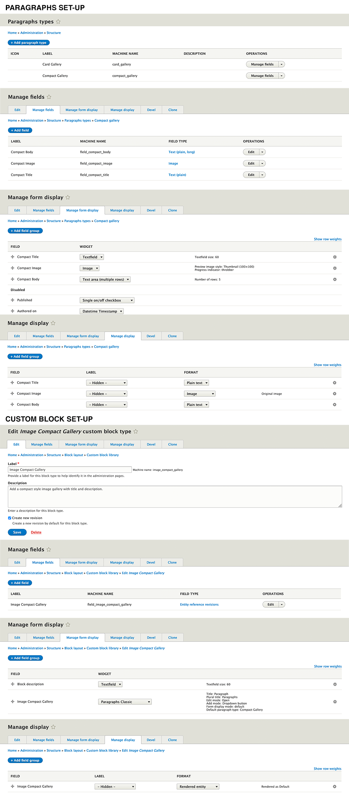

# *Add to the subtheme.libraries.yml*

#Image Compact Gallery  
image-compact-gallery:  
version: "1.0.x"  
css:  
theme:  
//cdnjs.cloudflare.com/ajax/libs/baguettebox.js/1.10.0/baguetteBox.min.css: {  type: external, minified: true }  
templates/block/custom/image-compact-gallery/css/compact-gallery.css: { }  
js:
//cdnjs.cloudflare.com/ajax/libs/baguettebox.js/1.11.1/baguetteBox.min.js: {type: external, minified: true,  scope: header }  
templates/block/custom/image_compact_gallery/js/compact-gallery.js: {}
dependencies:  
- core/jquery  

# *Add to the repositories section in the subtheme composer.json*

"repositories": [  
{  
"type": "vcs",  
"url": "https://github.gatech.edu/ICWebTeam/block_image_compact_gallery.git"  
}
# *Add to the requirement in the subtheme composer.json*

"require": {  
"drupal/paragraphs": "^1.12", 
"gt/image_compact_gallery": "dev-master",  
"mnsami/composer-custom-directory-installer": "^2.0"
},

# *Add to the installer paths in the subtheme composer.json*
"installer-paths": {  
"web/themes/contrib/subtheme/templates/block/custom/image_compact_gallery": [  
"gt/image_compact_gallery"  
]  

# *Implements hook_page_attachments_alter(). in subtheme.theme*
function SUBTHEME_page_attachments_alter(&$page) { 
$page['#attached']['library'][] = 'SUBTHEME/image_compact_gallery'; 
}
},

# *Install the Paragraphs Module*
composer require drupal/paragraphs

# **CUSTOM BLOCK  SET-UP**

